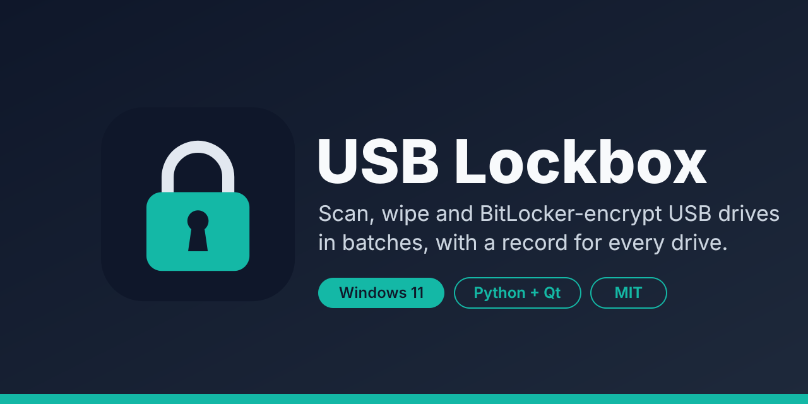

# USB Lockbox

Scan, wipe and BitLocker-encrypt USB drives on a Windows 11 (Pro or Enterprise) PC, in batches, with one big status tile per USB port and a CSV row plus a PDF record for every drive. Python + PySide6. No installer, no database.

## Get started

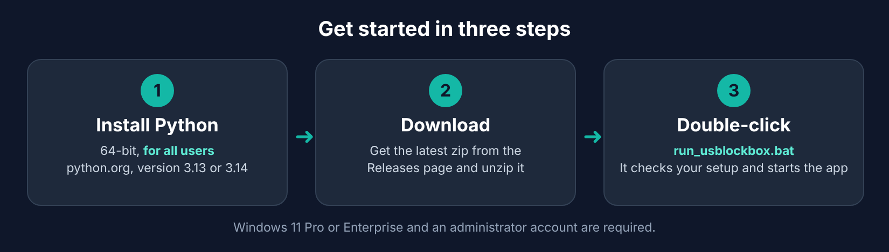

You need **Windows 11 Pro or Enterprise** (for BitLocker) and an **administrator account**.

> [!IMPORTANT]
> Install **64-bit Python for all users**. A Python installed for just your user (the Microsoft Store version, or the python.org "Install Now" button) can fail when Windows asks for a different administrator's password, so the launcher refuses it.

### 1. Install Python (64-bit, for all users)

1. Go to the [Python for Windows download page](https://www.python.org/downloads/windows/) and download the **Windows installer (64-bit)** for Python **3.13 or 3.14**. Versions 3.10 to 3.14 work.
2. Run it and choose **Customize installation**. Make sure **Install Python for all users** is ticked. The wording can differ a little between installer versions.
3. Finish the installer.

Already have Python? Skip this step. The launcher in step 3 checks it for you and tells you if it needs changing.

### 2. Download USB Lockbox

Download the latest zip from the [Releases page](https://github.com/peterkremmer/usb-lockbox/releases) and unzip it somewhere you can write to, such as `C:\USB Lockbox`. (Or clone the repository.)

### 3. Double-click `run_usblockbox.bat`

The launcher checks your setup before it starts the app:

* If Python is missing, too old, 32-bit or installed for your user only, the launcher window says so, shows what to do, and stays open until you press a key. If it cannot find Python right after you installed it, close the window and run it again; if that still fails, sign out and back in.
* If the packages the app needs (PySide6, reportlab) are missing or too old, it offers to install them. Windows asks you to approve administrator access for that.
* Then the app starts and Windows asks for administrator rights (UAC prompt). Approve it.

> [!NOTE]
> On first start the window can show **Scanning USB ports...** for a while. On some PCs, especially with security software, this can take up to a minute. If something goes wrong, click **Diagnostics > Save diagnostics for support...** and send me the file. See [Troubleshooting](#troubleshooting).

Advanced: using a per-user Python

If you sign in as an administrator and want to use a per-user Python anyway, run `set USBLOCKBOX_ALLOW_USER_PYTHON=1` in Command Prompt and start the launcher from that window.

> **Status: early (v0.1.x).** Tested with unit tests, a headless GUI test and a few USB flash drives on one Windows 11 PC. Expect rough edges. The app starts in **dry-run** (it scans and plans but erases nothing). Once you turn dry-run off, it **permanently erases the drives you process**, so try it on sacrificial drives first. No warranty (see [LICENSE](LICENSE)).

Planned work and fixed issues: [ISSUES.md](ISSUES.md). Security notes: [SECURITY.md](SECURITY.md).

## What it looks like

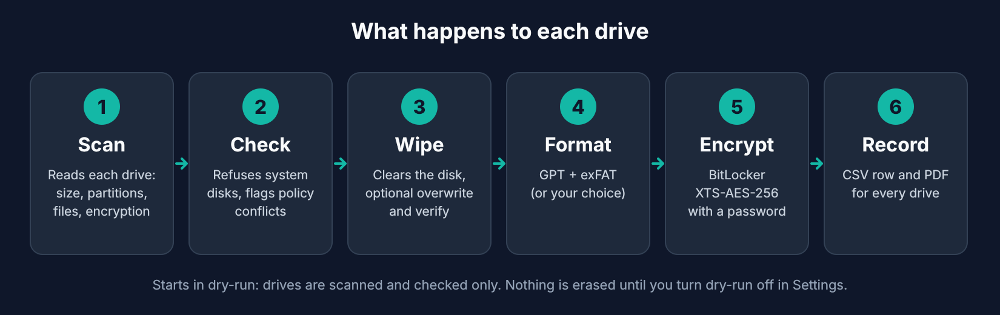

The main window in dry-run. Each tile is one USB port; the reasons a drive needs work are listed on it:

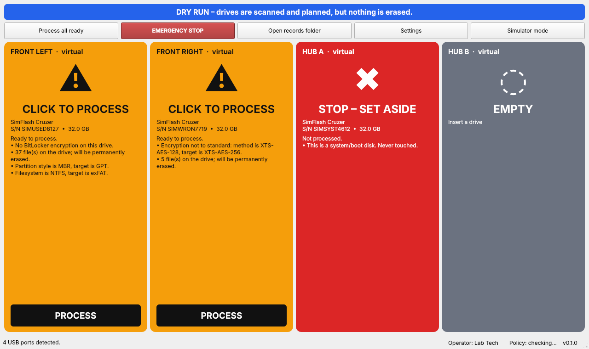

A batch in progress. Each tile shows when it started, how long it has run, about how long is left and when it should finish. The strip under the banner covers the whole batch:

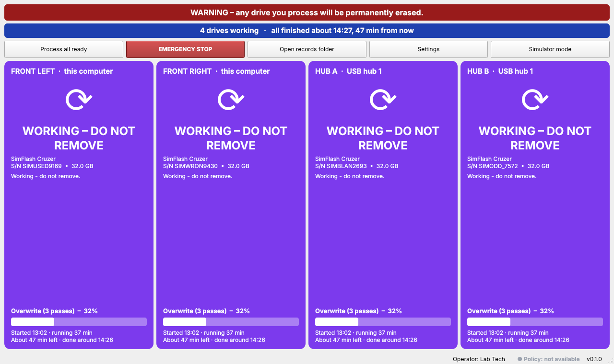

A drive that stalls or runs far slower than usual turns amber and is named in the strip, so someone returning to the PC sees it at once:

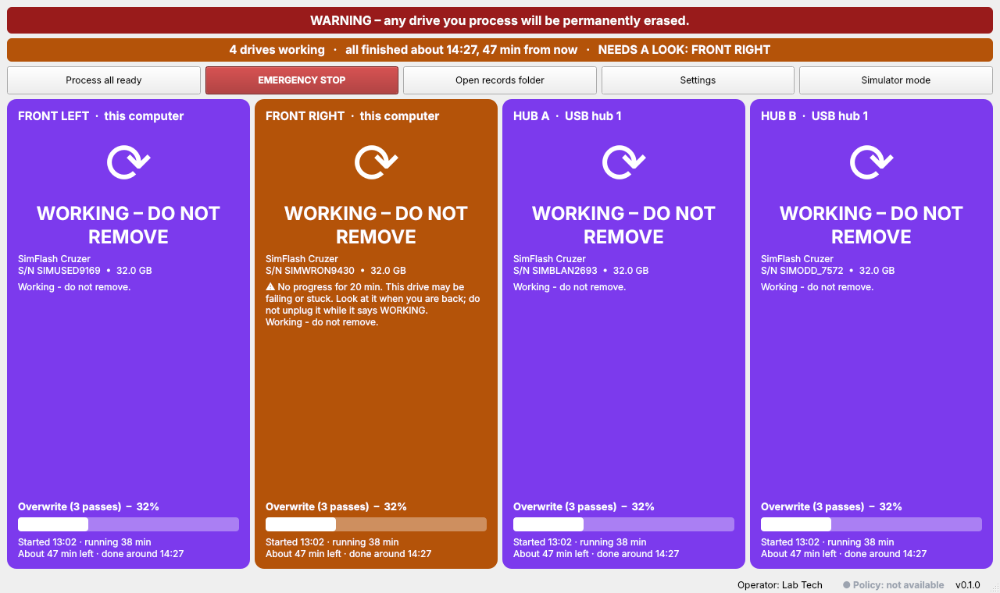

When the last drive ends, the strip says when the batch finished and how long it took, and failed drives are called out:

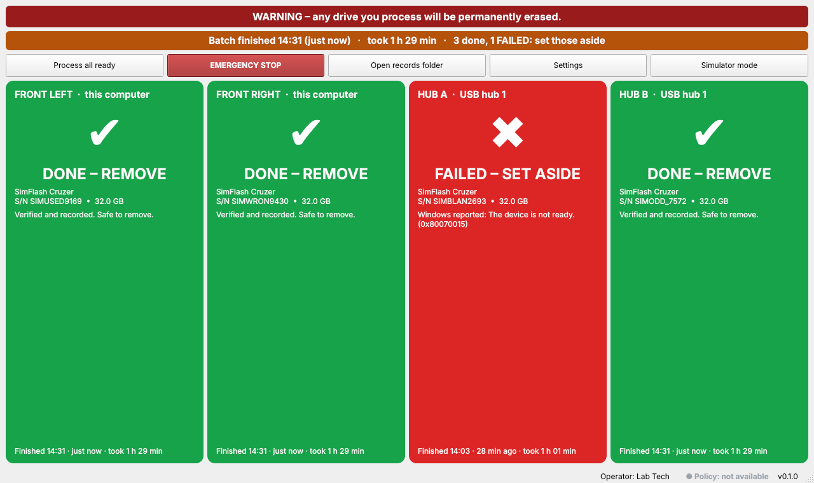

| Settings > Ports | Settings > Encryption | Settings > Safety |
|---|---|---|
| 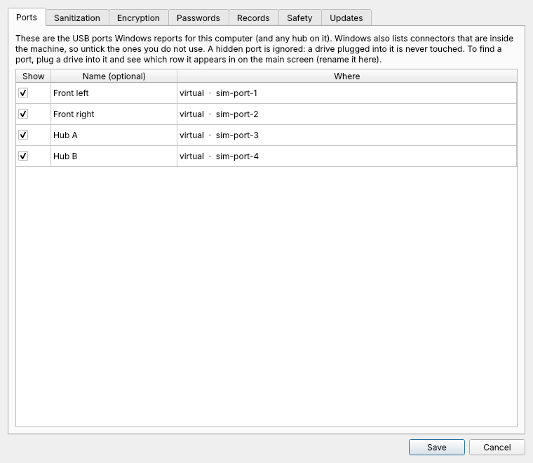 | 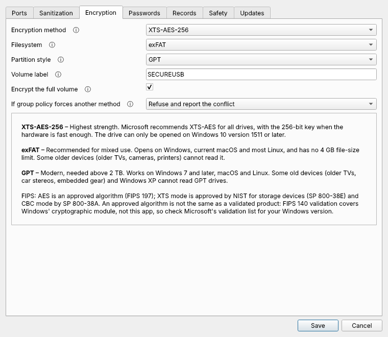 | 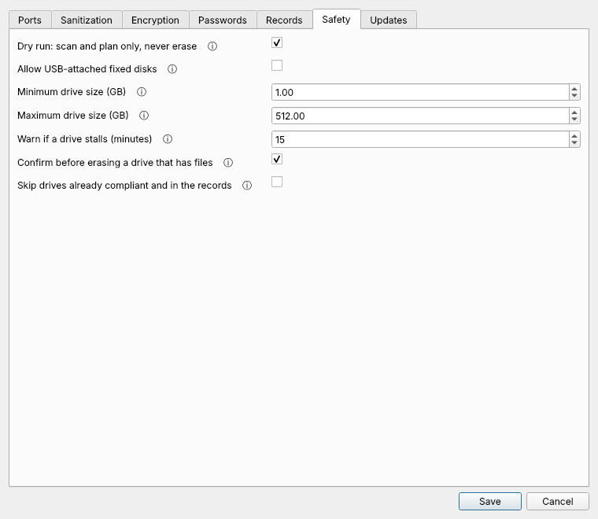 |

Simulator mode (virtual drives, nothing touches a real disk):

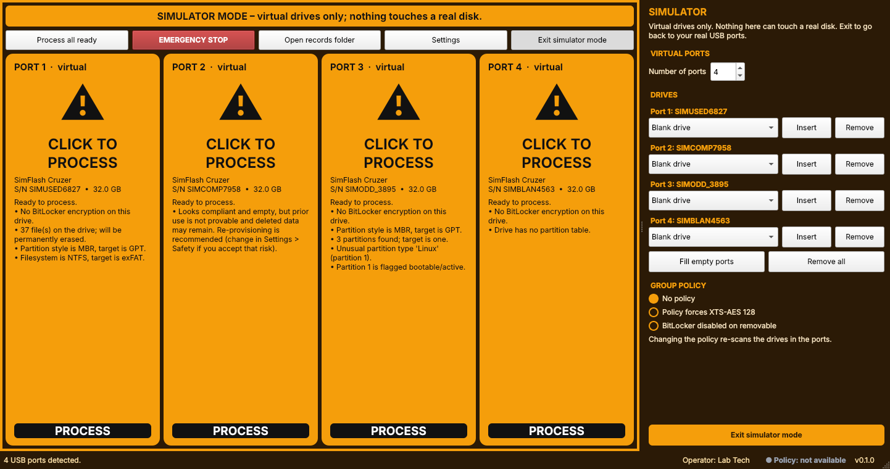

## Using it

**On launch** the app reads the USB ports Windows reports and shows one tile per port. Plug in a hub and its ports are added; unplug it and they go away. Windows also reports connectors that are inside the machine, so use **Settings > Ports** to untick the ones you do not use and to name the rest ("Front left"). Drives on ports the app does not list or that you hid are ignored.

**Dry-run** (blue banner) is the default: drives are scanned and planned, nothing is erased. To erase drives, untick **Dry run** in Settings > Safety (needs Windows and administrator rights). The banner turns red and says that any drive you process will be permanently erased. No restart is needed. For a first real run, use a drive you do not mind losing, on a spare PC if you can; security products may flag raw disk writes, in which case allow-list the app folder.

The operator name in records is the signed-in Windows user, shown at the bottom of the window.

### Walk-away batches

Plug in a row of drives, click **Process all ready** and leave. Each working tile shows when it started, how long it has run, about how long is left and when it should finish. The strip under the banner shows how many drives are working and when the whole batch should finish; afterwards it shows when the batch finished and how long it took.

* Estimates start as rough guesses (marked "rough guess") and switch to rates measured on your PC after the first drives. They are kept in `data/timings.json`.
* A working drive turns **amber** and is named in the strip if it makes no progress for 15 minutes (change in Settings > Safety), runs at less than a third of its usual speed, or runs far past its expected time. Nothing is stopped automatically; the message says to look at it.
* The taskbar button flashes, and a beep sounds, when the batch finishes or a drive needs a look.

### Simulator mode

Click **Simulator mode** in the toolbar. The window turns orange, and a pinned panel opens on the right where you choose how many virtual ports there are and insert or remove a virtual drive in any port (blank, used, wrong method, odd boot records, hardware-encrypted, a fake "system disk", write-protected, ...), fill all empty ports, and simulate Group Policy conflicts. **Exit simulator mode** puts everything back to normal.

## Tiles

| Color | Text | Meaning |
|---|---|---|
| Grey | EMPTY | Nothing in the port |
| Blue | CHECKING | Read-only scan running |
| Amber | CLICK TO PROCESS | Needs work; reasons listed on the tile |
| Purple | WORKING - DO NOT REMOVE | Wiping / encrypting (progress bar, time left) |
| Brown-amber | WORKING, with a warning | Stalled, much slower than usual or overdue; see the message on the tile |
| Green | DONE - REMOVE / ALREADY OK - REMOVE | Verified and recorded |
| Red | STOP / FAILED - SET ASIDE | Rejected by a safety check or policy, or a step failed. Reason on the tile |

Colors are remappable in `settings.json` (`colors`, `#rrggbb` only). Every state also has an icon and words.

## Where things are stored

Everything defaults to a `data` folder **next to the app** (the folder holding `run_usblockbox.py`):

| What | Default location |
|---|---|
| Settings | `data/settings.json` |
| Time estimates | `data/timings.json` |
| CSV log | `data/records/usblockbox_log.csv` |
| PDFs | `data/records/pdf/` |
| Update backups | `.update_backup/` |

Change the CSV and PDF folders in **Settings > Records** (a "Default" button resets them). If the app folder is read-only, the per-user profile folder is used instead and Settings says so. Set the environment variable `USBLOCKBOX_HOME` to use a different base folder.

`data/` is in `.gitignore`: it holds your encrypted fixed password and records. Never commit it.

## Updates

On start-up the app asks GitHub for the latest release (one HTTPS request, nothing else sent; switch it off in Settings > Updates). If there is a newer version a green bar appears; click it to read the notes and choose **Update now**. The update is only installed when you confirm, only if the release has a zip plus a published SHA-256, and only when no drive is being processed. Your `data/` folder is never touched and replaced files are backed up. A git clone is never modified: the app tells you to `git pull`. See [RELEASING.md](RELEASING.md).

## Policy status

The status bar shows a **Policy** indicator: green = no BitLocker policy conflicts, amber = notes, red = a policy blocks processing, grey = cannot be read here (non-Windows). Hover for the summary, click for the full table of GPO / Intune settings it found. The same findings also appear on the drive tiles.

## What the scan checks (read-only)

USB bus, removable flag, size limits and a listed USB port; system disk; write-protect; hardware-encrypted or multi-LUN devices; BitLocker state (method, % encrypted, locked, whether the fixed password opens it); file content; partition style, extra or odd partitions, active flag, boot code in the first sector; BitLocker policy from GPO/Intune (conflicts are reported with the setting and source, never overridden).

File counts say where the files are (top level or in folders, hidden ones marked), and system folders get plain names: Windows disk-check (`FOUND.000`) recovery folders, the Recycle Bin, Mac Spotlight and Trash folders, and similar.

## Encryption choices (Settings > Encryption)

Methods are shown the way Microsoft writes them: XTS-AES-256 and XTS-AES-128 (Windows 10 version 1511 and later) and the older AES-CBC-256 / AES-CBC-128 (only for drives that must open on Windows 8.1 / Server 2012 R2 or earlier). Each choice has a hover explanation and a plain-language note under the form, including exFAT/NTFS/FAT32 and GPT/MBR trade-offs. XTS-AES is approved by NIST for storage devices (SP 800-38E); that is about the algorithm, not a FIPS 140 validation of the product. If Windows' own FIPS policy ("Use FIPS compliant algorithms") is on, Windows refuses to create a BitLocker recovery password, which this app adds to every drive, so encryption can fail on such a PC.

## What processing does

Clear partitions and boot records, zero the first and last MB, overwrite passes (default 3, 0 = skip), partition and format (GPT or MBR, exFAT by default), BitLocker XTS-AES-256 (full volume) with password and recovery protectors, wait for 100%, verify (method, protectors, unlock test), lock. Only then is the record written and the tile turned green. If the record cannot be written, the tile is NOT green.

## Safety nets

Never touches boot/system/pagefile disks, non-USB buses, fixed disks (unless allowed), drives on USB ports the app does not list, or a drive holding the app or records folders. Identity (serial + unique id + size) and eligibility are re-checked before every destructive step. Emergency stop; mid-run removal = FAILED; dry-run by default; turning dry-run off requires Windows and an elevated session.

## Records

* `usblockbox_log.csv`: one appended row per run, with `prev_hash`/`row_hash` chaining so accidental or casual edits are detectable (`records.verify_chain`). The chain is **not keyed**, so it is not proof against someone who deliberately recomputes it. Cells starting with `= + - @` get a leading `'` (Excel formula-injection guard). If Excel has the file open, writes retry for about 3 seconds and then the run is marked failed rather than losing the record.
* One PDF per drive, named `timestamp_serial.pdf`.
* **Passwords and recovery keys: PDF on, CSV off by default.** Switch each in Settings > Records. With the CSV on, it is a clear-text master key list: restrict access to its folder.
* The CSV doubles as the drive history (looked up by serial).
* The operator name (Settings, or the Windows user name if blank) and the computer name are written into every record.

## Honest limits

* An overwrite on flash media is NIST 800-88 **Clear**, not Purge. The record says so. Drives with unknown history are flagged for Destroy or documented risk acceptance if they held regulated or sensitive data.
* "Already compliant" drives are re-processed by default (empty is not proof of clean). Opt in to skipping them under Settings > Safety.
* Time estimates are estimates. USB drives do not report health data the way hard disks do, so slow or stalled drives are caught by timing only.
* Some Windows behaviours are not yet checked on other PCs and editions (GPO/Intune value names, DPAPI when the elevated process runs as a different account, and others). They are listed in [ISSUES.md](ISSUES.md).
* The capacity (counterfeit-drive) test is not implemented.

## Troubleshooting

**Logs.** The app keeps a small log in `data\logs`: `usblockbox.log` (what the app did and how long each step took), `crash.log` (hard crashes) and `launcher.log` (what the launcher check found). The log rotates at 1 MB, keeps 5 files and deletes files older than 30 days, so it cannot grow without limit. It never contains passwords or recovery keys. When something goes wrong, click **Diagnostics > Save diagnostics for support...** in the app: it zips the logs, a copy of the settings without secrets and a short summary into one file in that folder. Send that file. Drive records are not included. **Diagnostics > Open logs folder** opens the folder. The window shows "Scanning USB ports..." while the first scan runs, and after 45 seconds says the PC is slow to answer.

If you cannot start the app, send `data\logs\launcher.log` instead.

You normally do not need these. If you are asked for more detail, four read-only diagnostics print what the app sees (remove anything you do not want to share before sending the output):

    py -m usblockbox --ports-dump        USB hubs, ports and which drive is on which port
    py -m usblockbox --selftest-windows  disks, serials, partitions and BitLocker state (run elevated)
    py -m usblockbox --policy-dump       the BitLocker policy settings it found
    py -m usblockbox --startup-timing    how long each step of the first scan takes (run from an administrator prompt)

`--startup-timing` shows which step of the first scan is slow, for example PowerShell start-up, one USB hub, or the disk listing. The saved diagnostics file already contains the same timings.

Report problems on the [Issues](https://github.com/peterkremmer/usb-lockbox/issues) page. For security problems see [SECURITY.md](SECURITY.md).

## Tests

    py -m pip install -r requirements-dev.txt
    py -m pytest -q
    py tools\ui_smoke.py out_dir       (headless GUI; set QT_QPA_PLATFORM=offscreen on non-Windows)

## License

MIT, see [LICENSE](LICENSE).
